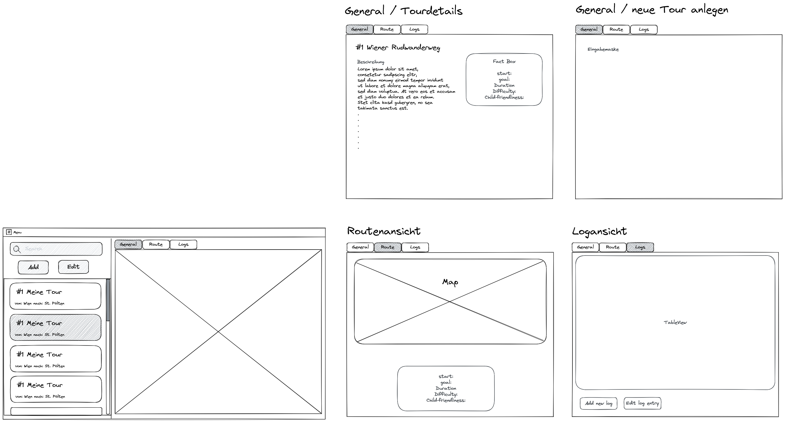
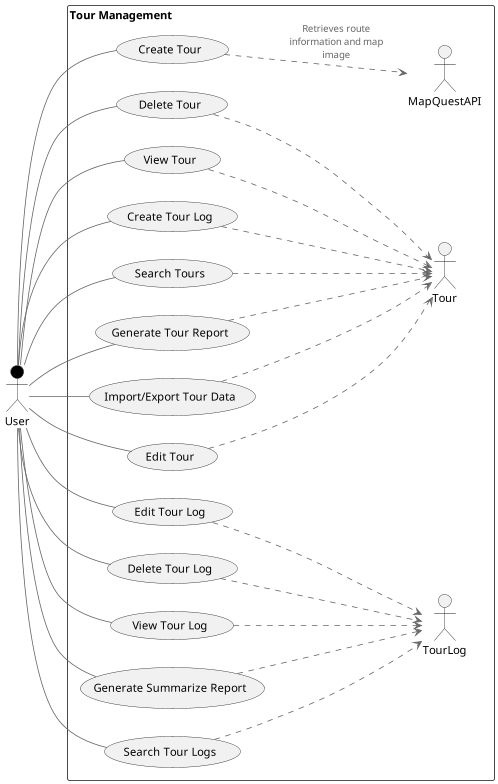

<div align="center">
    <h1>TourChamp</h1>
</div>

The TourChamp is a semester project for a software engineering class and is a native UI application using the JavaFX framework.
The application lets the user create and manage different tours (hiking, roadtrips, rail, etc.) including log data and reports.

As for the architecture, the MVVM (Model-View-ViewModel) pattern was used. The data is persisted using Hibernate and PostgreSQL.
Additionally, it integrates the [MapQuest API](https://developer.mapquest.com/) to generate route images.

## Setup


**Config file:** `src/main/resources/tourchamp.properties`

Fill in your Mapquest API Key and DB credentials.

```
MAP_API_KEY=

javax.persistence.jdbc.driver=org.postgresql.Driver
javax.persistence.jdbc.url=jdbc:postgresql://localhost:5432/tourdb
javax.persistence.jdbc.user=postgres
javax.persistence.jdbc.password=postgres
hibernate.dialect=org.hibernate.dialect.PostgreSQL95Dialect
hibernate.hbm2ddl.auto=update

```

**Database:**
To run the database, just execute this oneliner in your terminal.

Run the provided docker compose file to spin up the database:
```bash
docker-compose up -d
```

## Architecture

Our teams' focus was to implement different design principles from the SOLID collection rather than designing a pretty UI. This led to the following architecture:

The application is strictly split up into three layers: presentation -> businesslogic -> persistence. The layer above only implements the interface exposed by the layer below, so each layer could be exchanged with ease. The frontend models and the database entities are being mapped to/from DTOs to be transferred between the layers.

The presentation layer in specific uses the MVVM design pattern. As JavaFX has a rather old naming convention, the Controller classes represent the ViewModels in this case. The ViewModels are instantiated by the ControllerFactory and get their respective models injected. They then bind the View elements bidirectionally to the respective model property.

The communication between different Views is organized as a tree. That means that if a view fires an event, it only communicates it to it's parent view, the `MainController` in our case, which then executes the event downwards to it's destination.

### Library decisions

- JUnit5 & Mockito - *for unit testing*
- Lombok - *to reduce boilerplate code*
- Hiberate + Javax Persistence - *we decided against Spring as it would've been overkill*
- PostgreSQL - *as Database engine*
- Jackson - *to read and write JSON*
- log4j - *standard logging lib for java*
- itextpdf - *to generate the pdf tour reports*

### Design Patterns

Patterns utilized in this project:

- MVVM
- Factory
- Dependency Injection
- Observer
- Repository
- DTOs

## Wireframes & UX

We didn't spend too much time designing our UI, but nevertheless, this wireframe more or less depicts the look of our end result.



## Use cases



## Unit tests

Our approach to the unit tests was rather programmatic, due to time limitations. In addition, we couldn't easily test the frontend event handling due to the fact that our `MainController` gets its child controller members injected by the framework.

Nevertheless, we created tests for our businesslogic layer, the `TourLogic`, for the MapQuest request handling, the mapper methods, and the most important frontend models - including mocking & stubbing with Mockito.

## Lessons learned

As this kind of layered architecture was new to us, we struggled a bit in the beginning to get a hold of everything (Native UI, event handling, patterns, principles, etc.). We wanted to try an approach where the different layers are strictly seperated, also in terms of packages. But we realised over time that mapping 3 models over and over again is an unnecessary huge overhead on this application scale. Especially if you implement it barebone by yourself. But we managed to pull it off.

We deliberately chose not to use the Spring framework as it would have been an additional hurdle to understand the concepts of layered architecture and design patterns. By implementing more by ourselves we presumably took more out of the project on a foundational level.

## Unique Feature

As known from other tour planning apps, we integrated a possibility to lookup the cheapest train tickets on a platform called HappyRail.com for the currently selected tours.
The feature is available at the top menu when a tour is selected in the left tourlist and opens a new browser window.

## Time & Git

We spent roughly about ~100 hours on this project. A fair amount of (sometimes frustrating) debugging time included.

You can find the public project repository [here](https://github.com/Oscavian/tourchamp/).